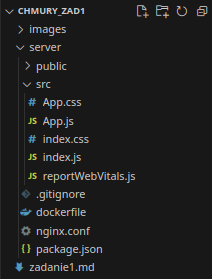
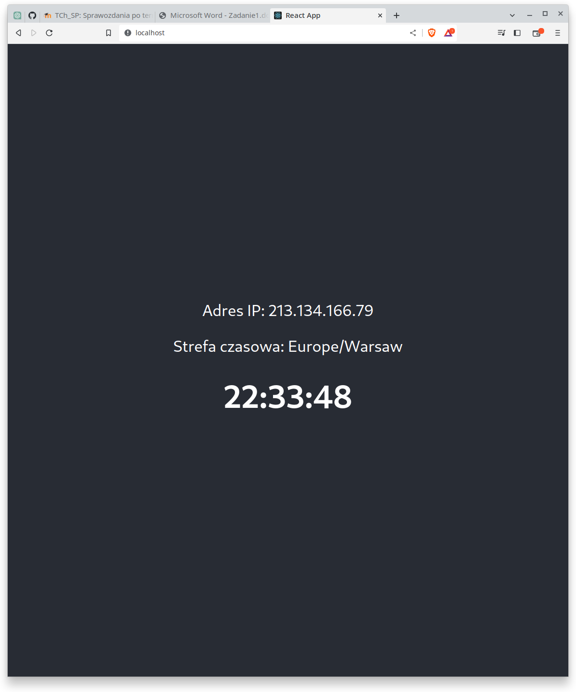
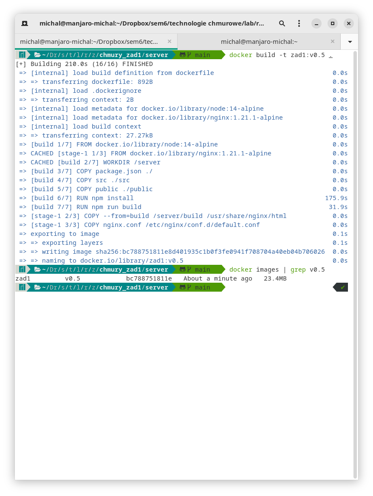
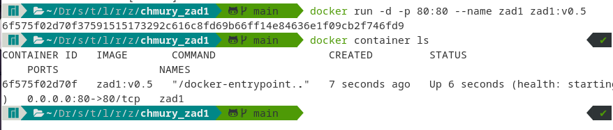
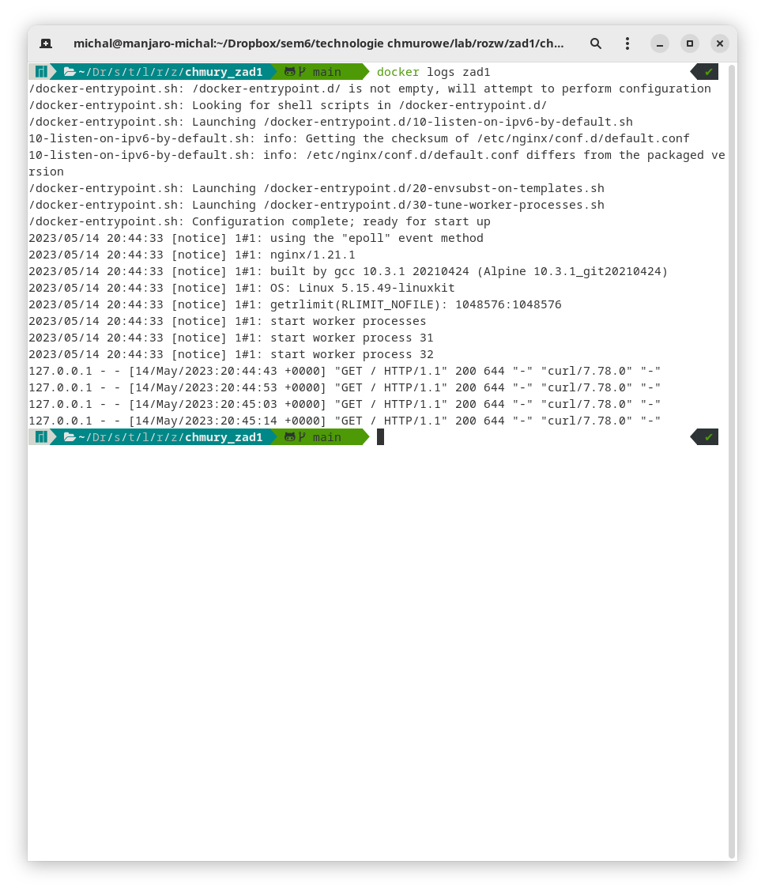
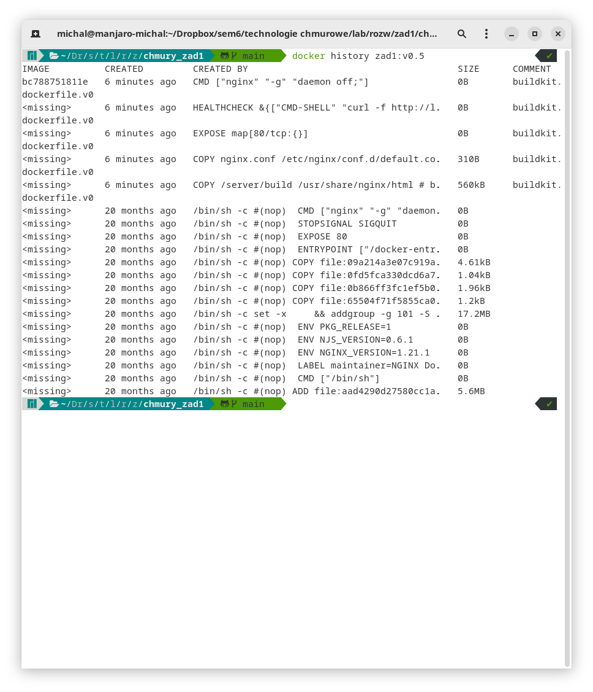

# chmury_zad1

Rozwiązanie zadania 1 z technologii chmurowych.

Michał Galant

Przed rozpoczęciem działań należy przejść do katalogu server:
`cd server`
Oraz pobrać obrazy potrzebne do budowania:
`docker pull node:14-alpine`
`docker pull nginx:1.21.1-alpine`

<h3>1. Struktura aplikacji</h3>

![Upload server/src/App.js]

<h3>2. Dockerfile</h3>

![Upload server/dockerfile]

<h3>3. Komendy</h3>

`docker build -t zad1:v0.5 .`

`docker run -d -p 80:80 --name zad1 zad1:v0.5`

`docker logs zad1`

`docker history zad1:v0.5`

